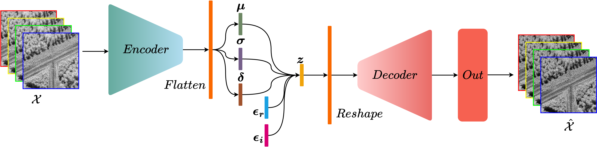

# Anomaly Detection in SAR imaging

## Abstract
We propose an unsupervised learning approach for anomaly detection in SAR imaging. The proposed model combines a complex-valued $\beta$ Variational Auto-Encoder (VAE) for unsupervised anomaly filtering, and an change detector based on the covariance matrix at the input and output of the $\beta$-VAE network.

## Architecture
Complex-valued Variational AutoEncoder


## Getting started
Anomaly Detection in SAR imaging with complex-valued Variational AutoEncoder and Reed-Xiaoli Detector.
To begin, clone the repository with ssh or https:

```
git clone git@github.com:ouioui199/complex-vae-for-sar-anomaly-detection.git
git clone https://github.com/ouioui199/complex-vae-for-sar-anomaly-detection.git
```

### Environment
Create a virtual environment with miniconda or other tools.
Details to install miniconda could be found [here](https://www.anaconda.com/docs/getting-started/miniconda/install).

### Install requirements
```
pip install -r requirements.txt
```

Install torchcvnn latest developments and install it as a library
```
git clone --single-branch --branch dev_transforms https://github.com/ouioui199/torchcvnn.git
pip install -e torchcvnn
```

We will use Pytorch-Lightning to organize our code. Documentations can be found [here](https://lightning.ai/docs/pytorch/stable/starter/introduction.html)

## Data folder structure
For quad-polarization images, the data folder container MUST be organized like below. Create folders if needed.
```
|- data_folder1/
|   |- L_band/
|   |- UHF_band/
|   |- X_band/
|   |   |- train/
|   |   |- predict/
|   |   |   |- reconstructed/
|   |   |   |- slc/
|   |   |   |   |- something_Combined_something.npy
|   |   |   |   |- something_Hh_something.npy
|   |   |   |   |- something_Hv_something.npy
|   |   |   |   |- something_Vh_something.npy
|   |   |   |   |- something_Vv_something.npy
|- data_folder2/
|   |- L_band/
|   |   |- train/
|   |   |   |- reconstructed/
|   |   |   |- slc/
|   |   |   |   |- something_Combined_something.npy
|   |   |   |   |- something_Hh_something.npy
|   |   |   |   |- something_Hv_something.npy
|   |   |   |   |- something_Vh_something.npy
|   |   |   |   |- something_Vv_something.npy
|   |   |- predict/
|   |- UHF_band/
etc.
```

## Data preparation
Anomaly map computed with the Reed-Xiaoli detector can be computed with the command below. Note that this code works with 4 polarization SAR images.
```python
python compute_RX.py --version 0 --data_band your-choice --datadir /your/data/folder/ --rx_box_car_size your-choice --rx_exclusion_window_size your-choice --rx_type your-choice
```

To evaluate with cross-shaped synthetic anomalies, run the file ```create_synthetic_anomalies.py```. Change line 141 and 142 to your data path, and change any class default arguments if needed from line 152 to 154.
```python
python create_synthetic_anomalies.py
```

## Training

### Step 1
To train the complex-valued VAE, run
```
bash train_reconstructor.sh > train_recon_log.txt 2>&1
```

To train or predict with Single Look Complex images, remove the argument ```--recon_train_slc``` in the shell script. Note that logs will be registered in the ```train_recon_log.txt``` file.

### Step 2
To perform predictions, run
```
bash predict_reconstructor.sh > pred_recon_log.txt 2>&1
```

The code will perform forward passes during prediction and output a reconstructed image. Then during the test process, it will compute the anomaly maps with the Frobenius change detector. By default, the code will test only with Frobenius boxcar of size 9x9 and 5x5. If you wish to test other boxcar size, feel free the change the ```ANOMALY_KERNEL=9``` argument in the shell script. To perform tests, we only need to predict once, so remember to add ```--recon_predict``` argument when calling code for the first time.

## Folder structure
Once start running the code, the folder will be organized as below. After cloning the code, create environments, install dependencies, you can start immediately the training. No further actions are required. All folders will be created automatically.
```
|- images/
|- scripts/
|   |- datasets/
|   |- models/
|   |- predict_reconstructor.py
|   |- train_reconstructor.py
|   |- utils.py
|- training_logs/
|   |- version X/
|   |   |- reconstructor
|   |   |   |- visualization
|   |   |   |- validation_samples
|- weights_storage/
|   |- version X/
|   |   |- reconstructor
|- .gitignore
|- compute_RX.py
|- compute_tsne.py
|- create_synthetic_anomalies.py
|- README.md
|- requirements.txt
|- predict_reconstructor.sh
|- train_reconstructor.sh
```
